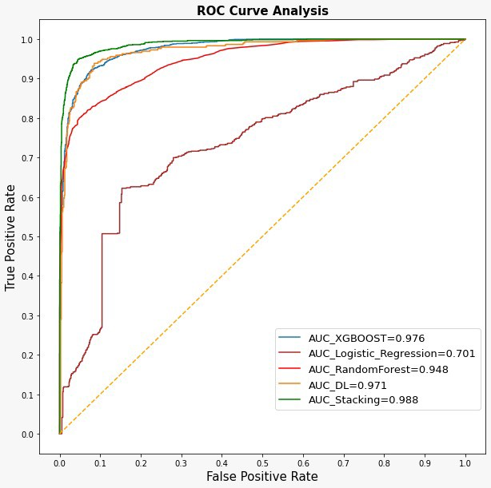

# covid_tweets
The coronavirus is affecting 219 countries and territories, significantly impacting the health care system and economy of almost every country in the world. Hospitals are overflowing, unemployment rates are increasing, and most countries are currently in recession.
We've developed an algorithm which is able to identify tweets of "Anti-Vaxxers" with accuracy of more than 90%.
We used ensembles (Begging, Boosting and Stacking) together with NLP, in order to reach this excellent score. 
This project is showing the process of our research, including our EDA & model notebook, which wil allow you to produce this algorithm by yourself.

## Installation

simply run `https://github.com/ronlevy120/covid_tweets.git` in your git bash. this will give you access to all of our notebook and code.

## Requirements

You have 2 option of how to view the notebook:
* `Jupyter Notbooks` (better with `Anaconda`)
* `Google Colab` (Should by available to anyone with Gmail account) 

## Acknowledgment

Many Thank you my team: Nofar, Noa and Neta. You can find Neta's repo, the main repo, at the beginning of the page link. This repo is just a copy of that repo.

  

